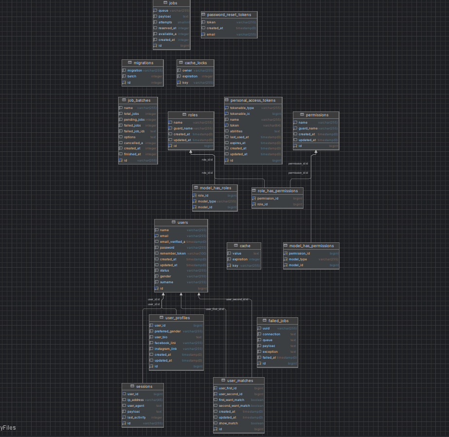

# Datespark

Tinder like inspired application to connect you to people

## Table of Contents

* [General info](#general-info)
* [Project setup](#project-setup)
    * [Backend](#backend)
    * [Frontend](#frontend)
* [Database](#database)
  * [ERD](#erd)
  * [Migrations](#migrations)
  * [Seeders](#seeders)
  * [ORM](#orm)
* [Backend documentation](#backend-documentation)
* [Tests](#tests)
## General info

The project is build upon react on frontend and laravel in backend.
Reasoning:

* React is fast-growing js library with stable version which was already tested in many production environment and support from both community in terms of libraries and problems solved in forums. 
* Laravel is full-fledged ecosystem that comes with many handy out-of-the-box solutions that allows to create functionalities with full scalability in MVC model without spending much time for setup of that workflow.

Frontend is straight forward if it comes to architecture. The page is rendered using React Router.
Next if page needs some data from backend it calls 'action'. Action is fetch for one endpoint which retrieves data from that endpoint.

Backend uses an MVC model as a base.
Controller is responsible for fetching model from repository and preparing data to be returned for client.

However, in order preserve clean code the backend code is also divided into services and actions. Services are responsible for holding all business logic related to given functionality and actions are classes which aggregates unit method for performing very specific action (i.e. creating model, updating model).

## Project setup
This section covers all the basic stuff related to starting project.

First and foremost the project is build using docker, in order to run this project you need to have docker installed.

If Docker is installed go to docker folder and run
```bash
docker compose up -d
```

Both backend and frontend will build its images and the containers will be run.
### Backend
In backend folder, copy file named .env.example and rename it to .env.

After that enter the php container using command:
```bash
docker exec -it {php_container_id} sh
```
or enter the interactive shell of php container in any other manner you like.

Then run the following commands in order to finish backend configuration
```bash
composer install
php artisan key:generate
php artisan migrate:fresh --seed
chmod -R 777 public
```
### Frontend
Frontend container is already setup and doesn't require any additional actions related to running it.

## Database

### ERD

The system contains 17 tables (some of them are related to internal laravel system like cache or cache_locks)

Many-to-many relations is defined for permission functionality (i.e. role_has_permission or model_has_roles)

### Migrations
All migrations are handled by laravel. In migration file laravel holds two methods, up and down that allows to migrate up or rollback changes if we need to discard changes made in database.

### Seeders
Laravel allows to create dummy data using seeders which are defined for roles, users and user profiles.
Admin login data:

Email: admin@example.com

Password: password

For users the emails are randomized but password are all the same it is password.
### ORM
ORM used in laravel is called Eloquent a powerful system which allows to access data from database using model related to that table.


## Backend documentation
All endpoints related to backend can be accessed and checked in localhost:9001/api/documentation. The documentation is build in swagger and allows to check information about each endpoint itself and make an example request.

## Tests
TODO

